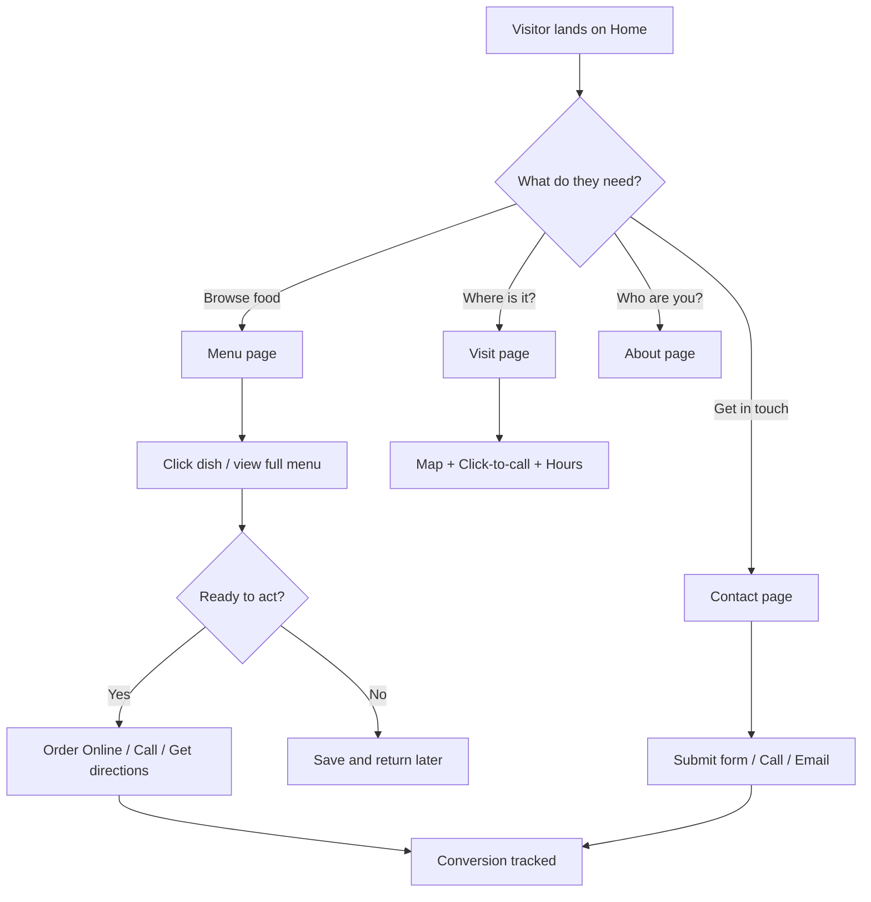

# Delight Kitchen Bistro & Cafe — Product Requirements Document

## 1. Product Overview

A mobile-first marketing website for **Delight Kitchen Bistro & Cafe** — a brunch, breakfast, lunch and dinner cafe in North Finchley — to convert nearby searchers, walk-in regulars and comparison shoppers into visitors, callers, and Uber Eats orders. Built as a single-page experience with five sub-routes (Home, Menu, About, Visit, Contact) to support discovery, menu browsing, and pre-visit decision making.

- **Target users**: New local customers searching Google/Maps, returning regulars, comparison shoppers comparing cafes in the area.
- **Primary conversion goals**: Click-to-call, tap for directions, click through to Uber Eats, and on-site menu / hours / photo trust.

## 2. Core Features

### 2.1 User Roles
This is a marketing site. No login or role distinction is required. All visitors have equal access to menu, gallery, contact, and order links.

### 2.2 Feature Module
1. **Home** — Hero, Trust strip, Signature dishes, Story snippet, Reviews teaser, Visit/Order CTAs.
2. **Menu** — Curated menu cards by category (Breakfast, Mains, Drinks, Desserts) with prices and descriptions; link to full PDF / order page.
3. **About** — Owner story, food philosophy, sourcing/halal commitment, gallery placeholder.
4. **Visit** — Address, hours, map embed placeholder, parking/transit, contact details.
5. **Contact** — Click-to-call, email form, social links, FAQ, dietary enquiry.

### 2.3 Page Details

| Page Name | Module Name | Feature description |
|-----------|-------------|---------------------|
| Home | Hero | Full-bleed interior/cafe image, headline, subhead, dual CTAs (View Menu, Order Online). |
| Home | Trust strip | Google rating "4.6 / 75 reviews", service tags (Brunch, Breakfast, Lunch, Vegetarian, Family, Halal, WiFi). |
| Home | Signature dishes | 3-card grid of best-selling dishes (Healthy Breakfast, Sourdough Avocado, American Dream pancakes). |
| Home | Story snippet | "From Our Kitchen" short paragraph with link to About. |
| Home | Reviews | 3 testimonial cards with star rating, source (Google), text. |
| Home | Visit strip | Address, hours, click-to-call, Order Online CTA. |
| Menu | Category nav | Sticky in-page anchor nav: Breakfast / Mains / Drinks / Desserts. |
| Menu | Menu cards | Full menu data, image, price (£), description, allergen/dietary tags. |
| Menu | Order Online | Outbound link to Uber Eats (configurable). |
| About | Story | Long-form owner paragraph, food philosophy, sourcing. |
| About | Gallery | 6 image placeholders with captions. |
| Visit | Map + Address | Embedded map placeholder, full address, transit notes. |
| Visit | Hours table | Weekday & weekend hours, last seating time. |
| Contact | Call/Email | Big click-to-call, email link, contact form (name, email, message). |
| Contact | FAQ | 4–6 most-asked questions (parking, dietary, booking, kids). |
| Global | Header | Logo, nav links, Order Online button, click-to-call on mobile. |
| Global | Footer | Address, hours, social, newsletter (optional), legal. |

## 3. Core Process

Primary user flows:

## 4. User Interface Design

### 4.1 Design Style
- **Aesthetic direction**: Editorial brunch-table warmth — warm cream paper background, deep forest green primary, terracotta accent, "linen" texture overlay, generous serif display headings paired with clean sans body. Evokes a neighbourhood bistro menu chalkboard meets a modern lifestyle magazine.
- **Primary color**: Deep Forest Green `#28382B` (text on cream, primary buttons, headings).
- **Secondary color**: Coffee Brown `#4F463A` (body text, secondary surfaces).
- **Accent color**: Terracotta `#C57C57` (CTAs, highlights, prices, underlines).
- **Highlight**: Linen Tan `#C0A384` (subtle backgrounds, hover states, badges).
- **Surface**: Off-white cream `#F4ECE0` (page background, cards).
- **Borders**: Garden grey `#E1E0E0` for table lines.
- **Buttons**: Pill-shaped (fully rounded) for primary CTAs, square with 1px border for secondary. Soft 2-step shadows only, no neon glow.
- **Typography**:
  - Display: `Fraunces` (variable serif, opsz/wght, optical size) for H1/H2.
  - Body: `Inter Tight` (or `DM Sans`) for paragraphs and UI.
  - Prices / micro-labels: `JetBrains Mono` for tabular figures.
- **Layout style**: Asymmetric editorial grid. Hero uses a large image bleed to the right, headline column left. Menu cards alternate image / text alignment. Generous 96–128 px section padding on desktop.
- **Icon style**: Thin-line `lucide-react` icons (1.5 stroke), no emoji by default. Stars use SVG (filled/outline) for ratings.
- **Texture**: Subtle SVG noise + paper grain on cream background, very low opacity (0.04). Subtle linen-weave pattern on cards.

### 4.2 Page Design Overview

| Page Name | Module Name | UI Elements |
|-----------|-------------|-------------|
| Home | Hero | Full-bleed right image, left column with H1 (serif), subhead, 2 CTAs (View Menu, Order Online), trust micro-line. |
| Home | Trust strip | Pill chips, terracotta star + "4.6/5 · 75 reviews on Google" headline, service tags. |
| Home | Signature dishes | Section header (eyebrow + serif H2), 3 cards with image top, name, price, 1-line description, "Add" ghost button. |
| Home | Reviews | Editorial 3-column with quote glyph, name, source. |
| Home | Visit strip | Split: left text, right map placeholder with overlay address card. |
| Menu | Hero | Compact banner: eyebrow "Today's Menu" + H2 + filter pills. |
| Menu | Menu list | Sectioned by category, each item as a row (image thumb / name & desc / price / dietary tags). |
| About | Story | Two-column long-form: portrait placeholder left, paragraphs right. |
| Visit | Hours table | Two-column: hours (left), address + map (right). |
| Contact | Form | Single column, generous spacing, large inputs, terracotta submit. |

### 4.3 Responsiveness
- Desktop-first design, fully responsive down to 360 px.
- Mobile breakpoints: 640 / 768 / 1024 / 1280 px.
- Mobile-first contact info: sticky bottom bar with Call / Directions / Order Online.
- All tap targets ≥ 44 px. Body text 16 px minimum.

### 4.4 Motion
- Staggered fade-in + small upward translate on hero (0.05s delay per element, total ~0.4s).
- Scroll-triggered reveals on section entries (IntersectionObserver).
- Hover on dish cards: subtle 1.02 scale + terracotta underline grow.
- No parallax, no flashy 3D — restrained editorial motion only.
