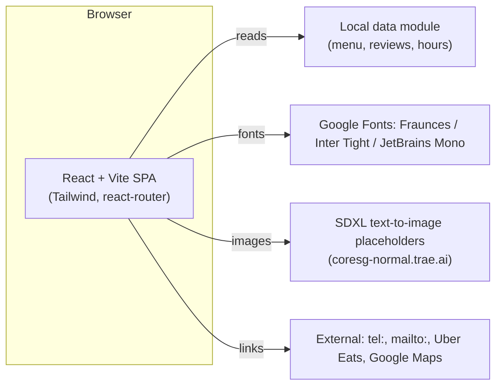
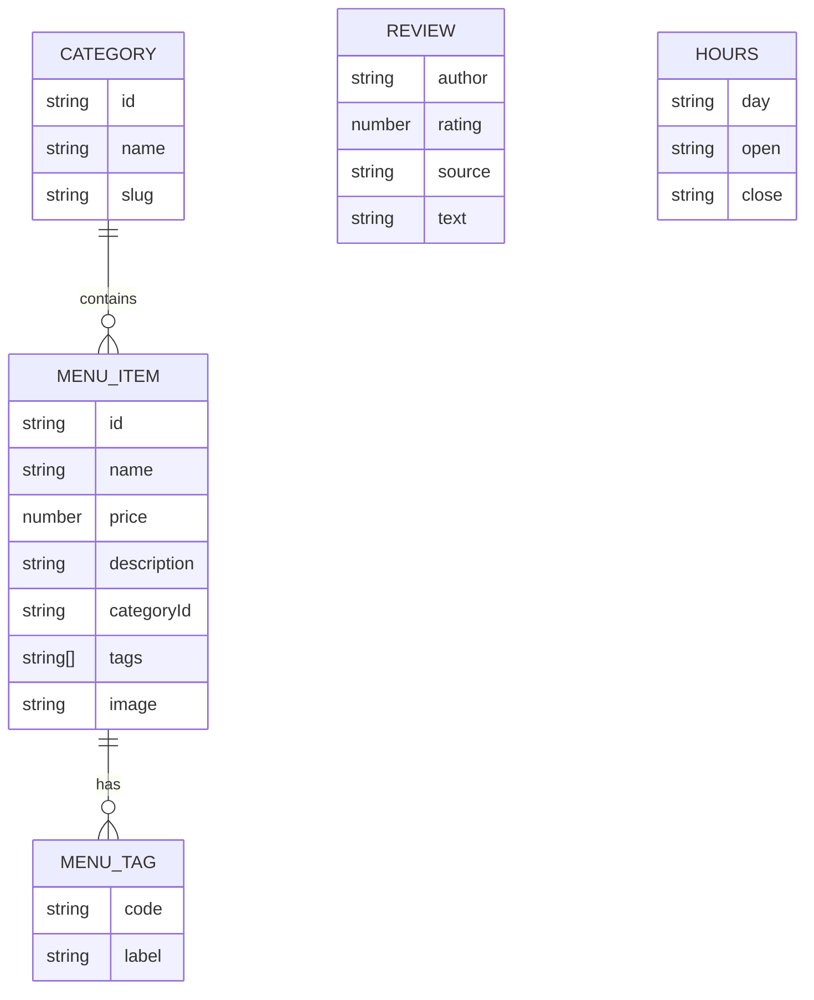

# Delight Kitchen Bistro & Cafe — Technical Architecture

## 1. Architecture Design

A pure frontend marketing site, no backend, no database. All content is mocked from a local `data/` module so the site is fully runnable from a static dev server.



## 2. Technology Description

- **Frontend**: React@18 + TypeScript + Vite
- **Styling**: Tailwind CSS@3 with a custom design token layer (forest green / terracotta / cream / linen)
- **Routing**: react-router-dom@6
- **State**: zustand (lightweight) — used only for the contact form draft & mobile nav open state
- **Icons**: lucide-react
- **Fonts**: Google Fonts (Fraunces, Inter Tight, JetBrains Mono) via `@import` in `index.css`
- **Initialization Tool**: `vite-init` with `react-ts` template
- **Backend**: None — fully static SPA
- **Database**: None — content lives in `src/data/site.ts` for easy editing
- **Package manager**: npm (default on Windows; pnpm if detected)

## 3. Route Definitions

| Route | Purpose |
|-------|---------|
| `/` | Home — hero, trust strip, signature dishes, story, reviews, visit strip |
| `/menu` | Menu — full breakfast / mains / drinks / desserts list with prices and tags |
| `/about` | About — owner story, food philosophy, gallery placeholders |
| `/visit` | Visit — address, hours, map, parking/transit notes |
| `/contact` | Contact — click-to-call, form, FAQ |
| `*` | 404 fallback — redirect to `/` |

## 4. API Definitions

No backend. Mocked in-app:
- `getMenu()` → returns typed `MenuItem[]` from `src/data/menu.ts`
- `getReviews()` → returns typed `Review[]` from `src/data/reviews.ts`
- `getHours()` → returns typed `Hours[]` from `src/data/site.ts`
- Contact form posts to a `console.log` stub with a `submitted` state. A real endpoint can be swapped later by editing one function in `src/lib/contact.ts`.

## 5. Server Architecture Diagram

N/A — no server.

## 6. Data Model

### 6.1 Data Model Definition



### 6.2 Data Definition Language (TypeScript types, in `src/data/types.ts`)

```ts
export type DietaryTag = 'v' | 'veg' | 'vgn' | 'halal' | 'gf' | 'spicy' | 'new';
export interface MenuItem {
  id: string;
  name: string;
  price: number;            // GBP
  description: string;
  category: 'breakfast' | 'mains' | 'drinks' | 'desserts';
  tags: DietaryTag[];
  image: string;
}
export interface Category { id: string; name: string; slug: string; }
export interface Review { id: string; author: string; rating: number; source: string; text: string; }
export interface Hours { day: string; open: string; close: string; closed?: boolean; }
```

All seed data is populated in `src/data/site.ts` based on the uploaded blueprint (Healthy Breakfast, Sourdough Avocado, Halal Full Breakfast, 4 Layered Pancake, American Dream pancakes, Organic Oat Porridge, plus sensible mains / drinks / desserts fillers to feel real).

## 7. Accessibility & Mobile-first baseline

- Semantic HTML5 (`<header>`, `<nav>`, `<main>`, `<section>`, `<footer>`, `<article>`).
- WCAG 2.1 AA contrast for all text on cream.
- 16 px minimum body text, 44 px minimum tap targets.
- Keyboard-visible focus rings using the forest green accent.
- `prefers-reduced-motion` respected: disables scroll-reveal & hover scale.
- Sticky mobile action bar (Call / Directions / Order) within thumb reach.
- All images have descriptive `alt` text; menu prices described in aria-label.
